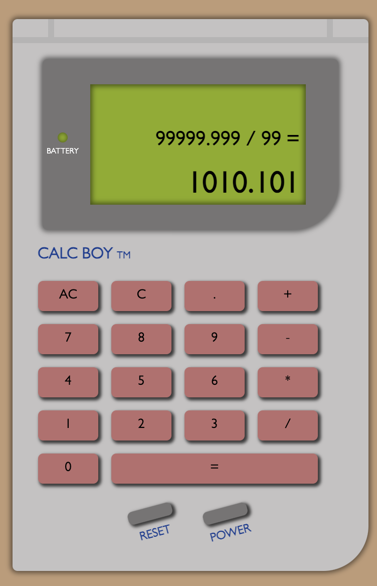

# Game Boy Calculator: "Calc Boy"
[Live Demo](https://nicholasrmccracken.github.io/gameboy-calculator): A calculator web app with support for elementary float operations styled as an original Game Boy console with HTML, CSS, and JavaScript.

## Features:
- Game Boy-like design replicating the look of the original console
- Power button with startup screen and classic Game Boy startup sound
- Addition, subtraction, multiplication, and division operations with decimal values

## Learning Outcomes: 
- Accounting for edge cases including dividing by zero, removing more numbers than available, negatives, etc
- Elementary mathematics and splicing operations on strings
- Functionality of button panels
